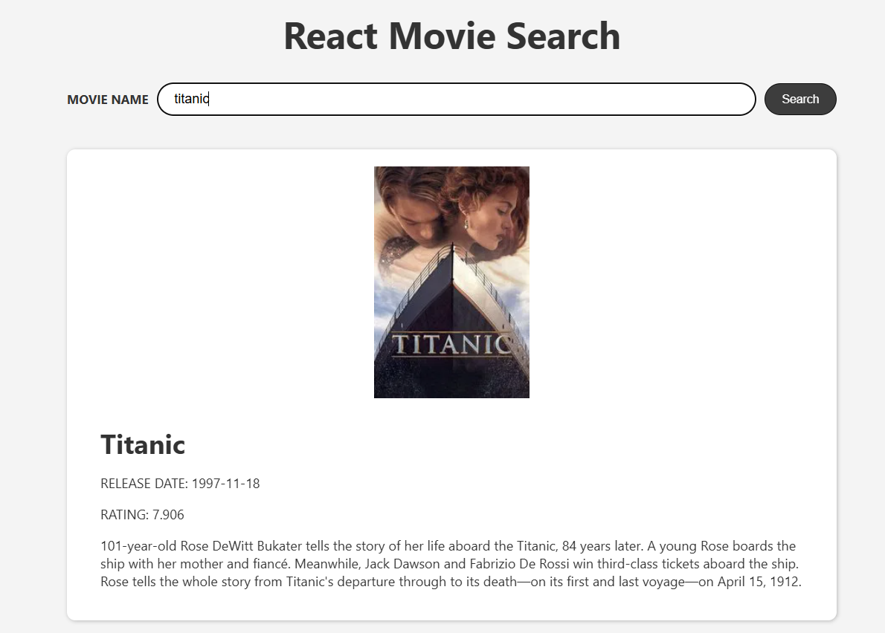

🎬 Movie Search App
This is a simple React application that allows users to search for movies by name and view detailed information about them.

Built with Create React App

🚀 Features
🔍 Search for movies by title

📃 View movie details including title, release date, rating, plot and poster

🌐 Uses an external movie API themoviedb

⚛️ Built using React functional components and hooks

🧪 How to Use
Start the app:

npm install
npm start
Search for a movie:

Type a movie name into the search input

Click the Search button

Movie results will be displayed below with their details

📸 Demo

🛠️ Available Scripts
In the project directory, you can run:

npm start
Runs the app in development mode.
Open http://localhost:3000 to view it in the browser.

npm run build
Builds the app for production to the build/ folder.